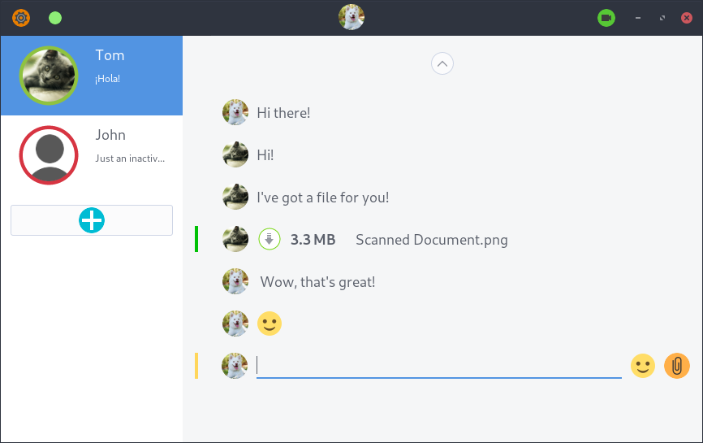
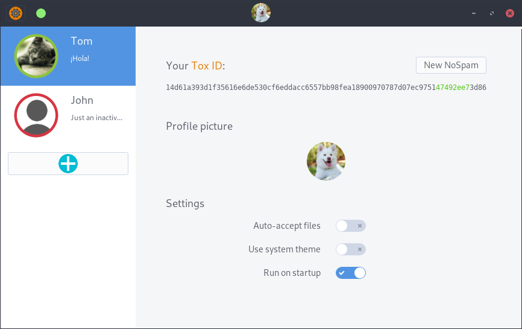

# Avion
*Simple instant messanger*

This is simple [tox](tox.chat) client written in **go**. It may still have some bugs. But if you like it, you're welcome to give it a try :)
 
 

# Some screenshots
## Main window

 
## Settings

 

 
### How to try it
#### You need linux and it should be 64 bit
##### *(if you're very patient you can try to compile it on your own, to 32bit)*
1. Install toxcore library
2. Download zipped repository or clone it
3. What you've got here:
    * screenshots
    * src - source code
    * uAvion - a binary and files it needs
4. Open terminal, **cd** to uAvion folder.
5. Run it: **./Avion**
6. That's it! Avion is working now. (I mean, it should)
7. Press **+** button and enter your friend's **Tox ID**
8. If your friend is online, it should connect in about 30 seconds
9. To write, just type

 
### Some instructions about usage
1. To change profile picture go to settings and just click your current avatar.
2. To write just type, to hide writing box, press **Esc**
3. To change your name or status, click tour profile picture in titlebar. It should expand, so by clicking on it's right or left side, you should be albo to write your new name or status message.
 
 

### If You'd like to compile it
To be honest I didn't know how to put it on Github, so you could compile it simply.
In src directory, you've got 3 packages. You have to add it to your **$GOPATH/src**, add some dependences and then
run **go build Avion**. 
##### These dependences are:
* [gotox](https://github.com/codedust/go-tox) - bindings for libtoxcore library
* [gotk3](https://github.com/gotk3/gotk3) - bindings fot GTK library
* [resize](https://github.com/nfnt/resize) - image resizing library

While installing **gotk3**, using **go get** or **go install**, it's very important to put in **-tags** your gtk version. Otherwise compilation of Avion can take ages, or give us some errors and just quit. It can be very irritating. Also after gtk update you have to recompile this lib running **go install** with proper arguments. For more info see [gotk3 wiki page](https://github.com/gotk3/gotk3/wiki#installation).

Remember to put binary file back in uAvion directory, before running it.

 
### Project future
To be honest I don't know if there's a point
continuing this project as there are other software,
which has got better features, lots of developers, and do basically the same...
 

### Two more things
I am not a proffesional programmer, that was just a hobby project, so please forgive me if it's done not as it should. You can always correct something :-)

Other thing is about security. If your privacy is very important to you, you have to know few things. Right now, there's no encryption in saving your messages. They are saved in **plain text**. Of course you can remove them whenever you want. To do it, go to uAvion folder (or other, where Avion is running) and remove "*FRIEND_TOX_ID*-messages" file.

